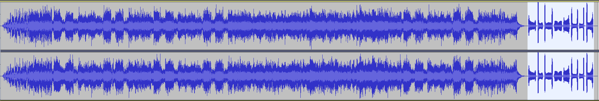
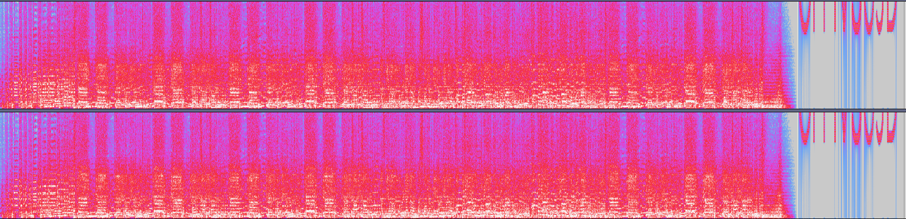
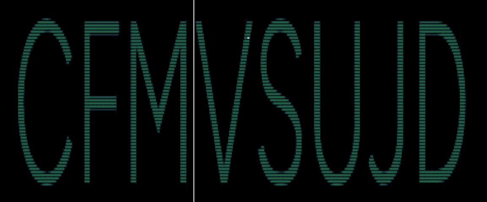
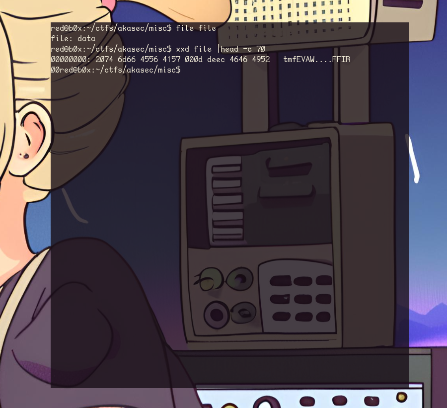
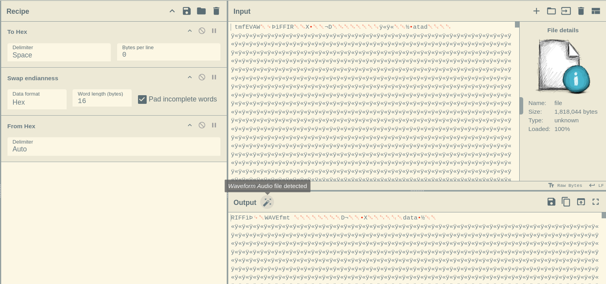
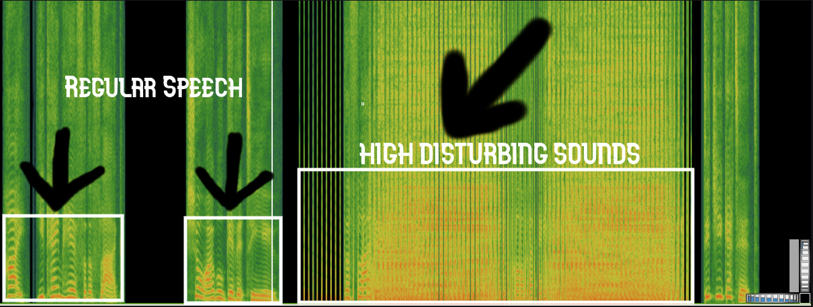
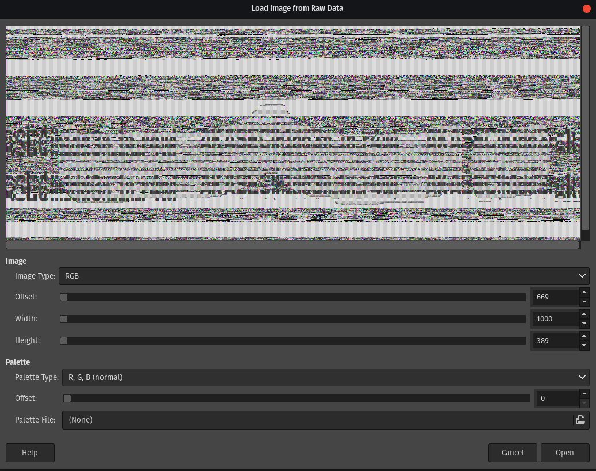
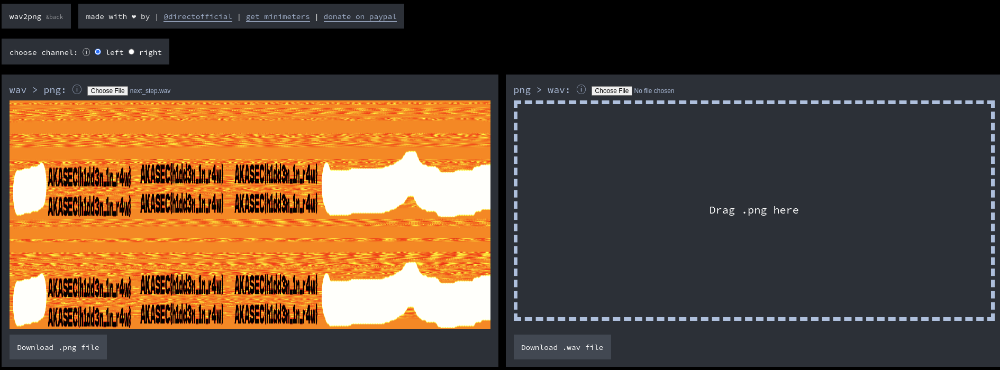
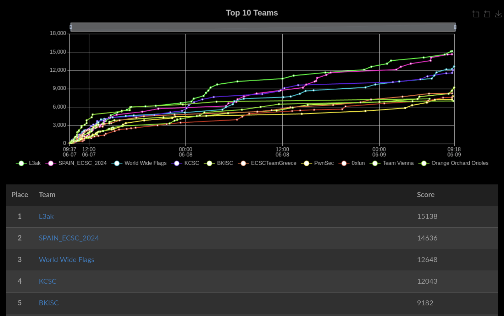

:::warning[Description]
**I hope you do not get a headache.**

**Author: d33znu75** 
:::


This weekend, I played in the `AKASEC CTF` and managed to solve the hardest miscellaneous challenge in the competition, which only six teams solved. As much as I want to call this challenge guessy, it really wasn't after the author released two hints. Overall, I enjoyed this challenge because it taught me something new.

We have a file named `National_Anthem_of_Palestine.wav`, which is in WAVE audio format and is 1 minute 39 seconds long. When opened, it plays the national anthem.

It's always good to check a file's metadata when dealing with a steg challenge, as it can often contain hidden information or useful clues on where to go next.

```sh

red@b0x:~/ctfs/akasec/misc$ exiftool -a National_Anthem_of_Palestine.wav
```

Running `exiftool` didn't yield any useful results back, so we should proceed with analyzing the file using programs such as `Audacity` and `Sonic Visualizer`. These tools offer more specialized functionalities for examining audio characteristics, such as viewing spectograms.



After opening the file in Audacity, we notice that towards the end, it emits some strange static noises which don't make sense. This unusual audio pattern could be a possible clue.



When changing the view mode from waveform to spectrogram, we notice what appears to be a string embedded at the end of the spectrogram. However, it's **not** clearly visible. To better look at it, we should consider using an alternative tool like Sonic Visualizer, which was mentioned before.




Following the same process as we would in audacity, but adding a few tweaks like expanding the spectogram channels and setting the `Threshold` to `-68dB` for a more clear view, we easily spot the readable string.

> ### `CFMVSUJD`

Great, we found what seems like the password! However, being a casual `CTF` player, I went down the rabbit hole trying to figure out if this string was encoded in some weird way, such as **ROT13** or other ciphers.

However, it seemed that the password **wasn't** encoded in any way. My next educated guess was to try using this password with a tool called `steghide` to see if I could extract anything useful.


**Steghide** uncovered something interesting, yet when I ran the `file` command, it returned **nothing**, labeling the data as `raw`. However, upon running `xxd file |head -c 70`, I observed that the file's **endianness** was swapped. Furthermore, this new file appears to be a wave file, indicating that we need to do some fixing ourselves.



There's two ways to go about this, one would be to write a quick `python script` to do the job for us. Another is to use `cyberchef`, which is more simpler and faster in my opinion. 



This is a quite simple recipe to deal with. We first open the file as input, convert it to `hex`, search for operation called `Swap endianness` --> set the `Data format` to hex and `Word length` to `16` bytes and finally do `From hex` with default options. 

Here's the recipe param for **CC**: `To_Hex('Space',0)Swap_endianness('Hex',16,true)From_Hex('Auto')`

As seen in the previous screenshot if everything was done correctly, cyberchef should identify this file as **Waveform Audio**. The next logical step would be to download it using the `save` icon in the middle right.

Once that is done we can follow the same steps as we did before, getting simple information about this file we know that, it's way smaller than the previous one. As well as, it's clear on what's its doing this time, there appears to be a voice saying `Here's a flag` followed by very high and disturbing sounds. 

Here goes the spectogram.



Once I reached this stage, my initial plan was to integrate a low-pass filter and adjust the decibels during high noise levels to suppress them somewhat. Some progress was made; I even managed to extract the phrase "Here's the Flag: AKASEC" from the audio. However, disaster struck again and again. This part of the challenge felt like hell as I tried mutltiple simultaneous approaches, ranging from basic `strings` commands to `400-line demodulation scripts`.

Though, a few hours later a new hint has been released for this challenge, which helped me quite a lot xD.

:::note[Hint]
This is a steganography challenge. In the voice audio, the flag hidden in the corrupted part and you must SEE it (it is the reason why it is corrupted). Switch it, a tool is needed.
:::

Key word there is **`SEE`**, but how is the real question here. Trying out tool's like `foremost` and `binwalk -dd` doesen't give anything, no pngs or jpgs. As mentioned previously this is the harder part of the challenge.

I have found 2 ways to solve this challenge, `intended` and `unintended`.

### Unintended Solution

This way forces us to visualize raw data with a popular tool called `GIMP` and manually `brute-force` offsets until the flag becomes visible, this method can get very time consuming and cause a lot of frustration.

Only thing to do here is, change the extension of the file we got from cyberchef from **.wav** to `.data`, open gimp and load it as raw data, from there it's just patience.




### Intended Solution

By far easier way to go on solving this challenge, by doing a simple google search "wav2png". First result that pops out is a website which will automatically convert waveform to png, without having to guess offsets `xD`! 

`https://directmusic.me/wav2png/`

(shoutout to **suvoni** for finding this tool)




:::caution[FLAG]
`AKASEC{h1dd3n_1n_r4w}`
:::

Thanks for reading this write-up! I hope you learned something new, because I sure did. This **CTF** was well organized with diverse challenge categories, great admins and high quality challs. Looking forward to next year 👀


**Stoked to come in 🥇1st place with my team!**



**Till next time~**