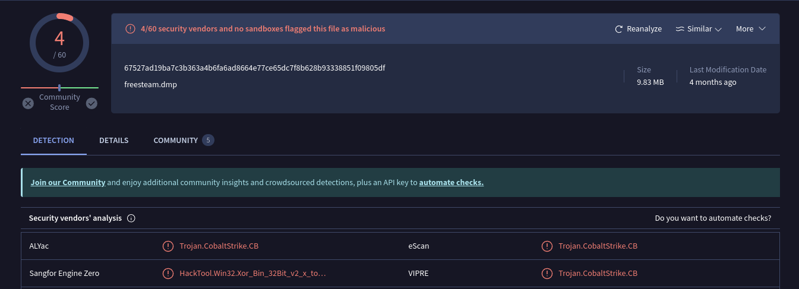
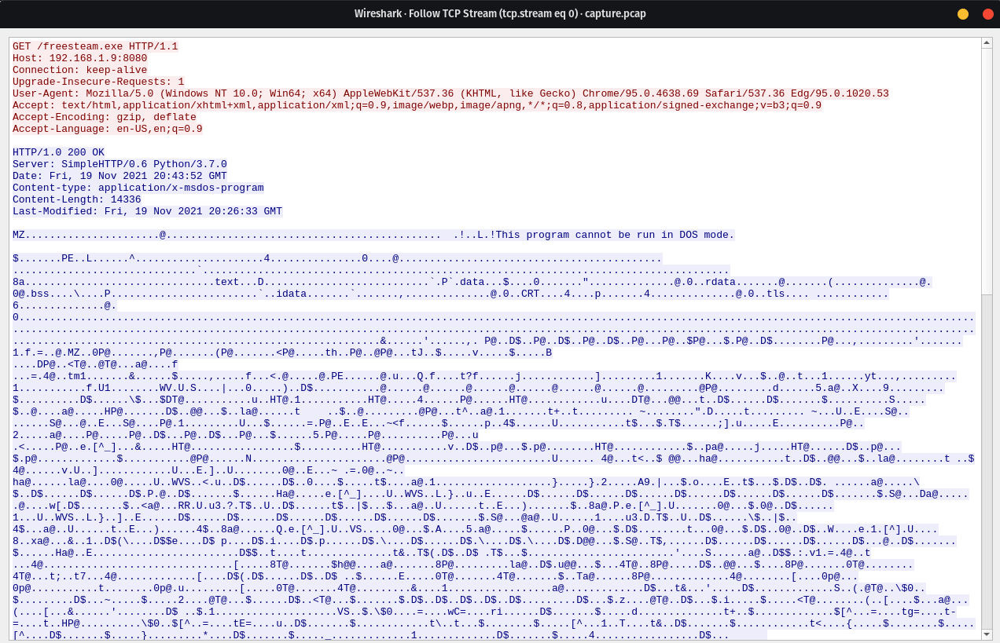
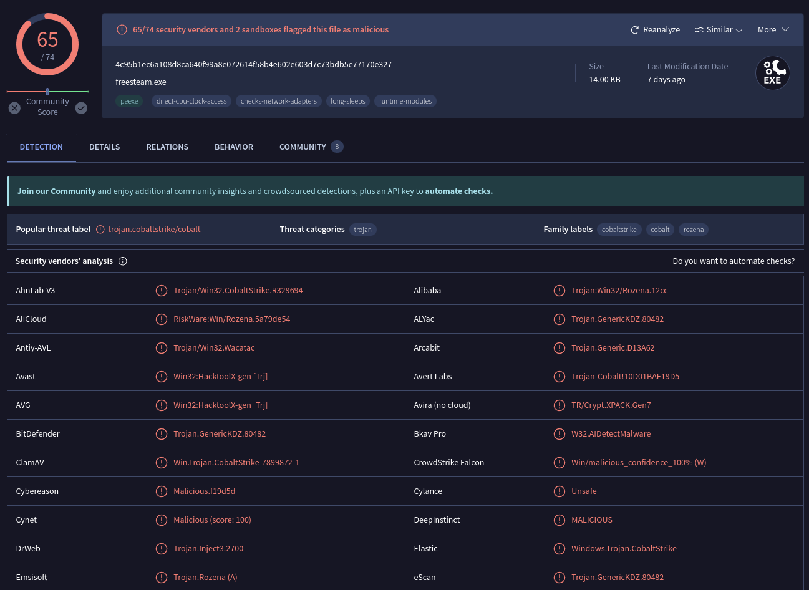
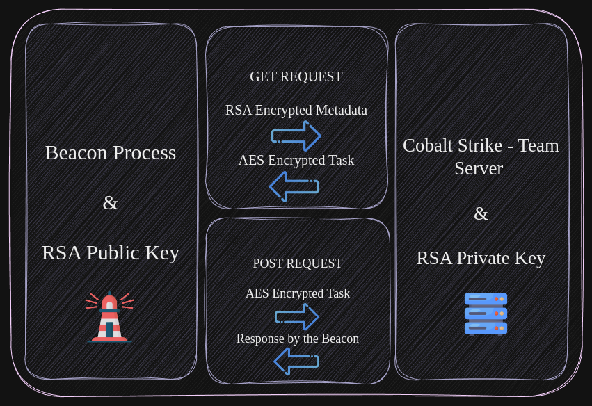
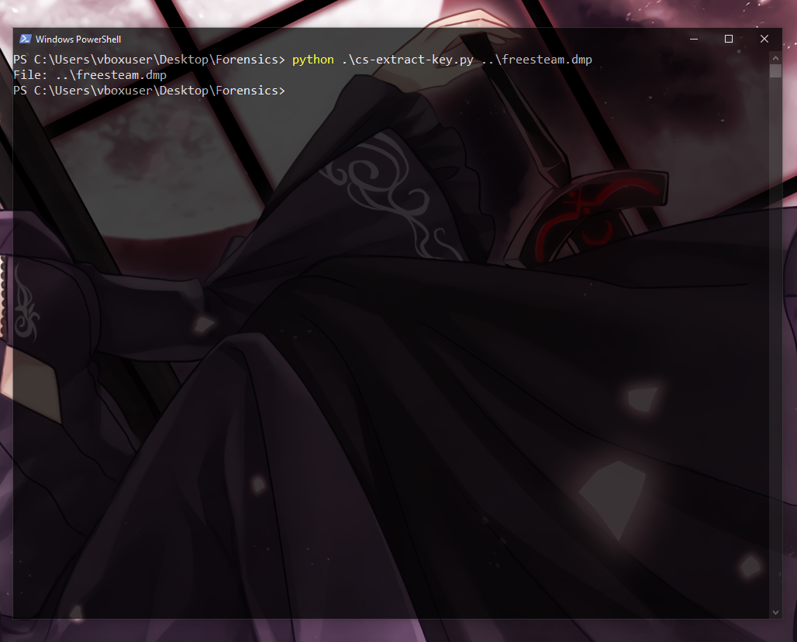
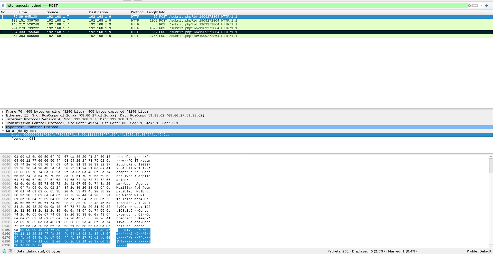
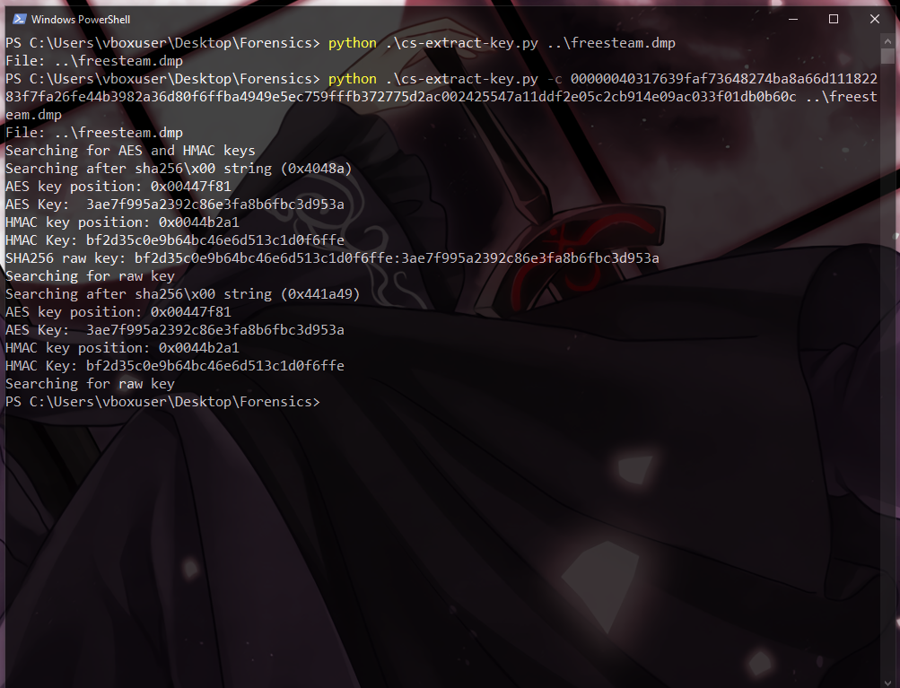
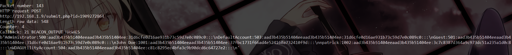
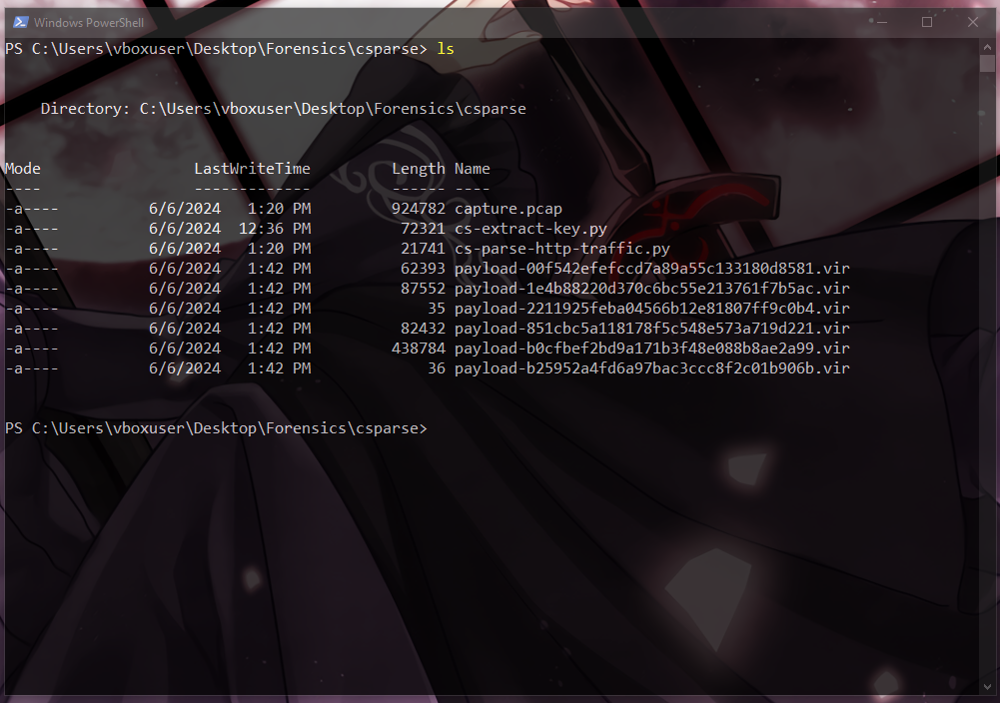
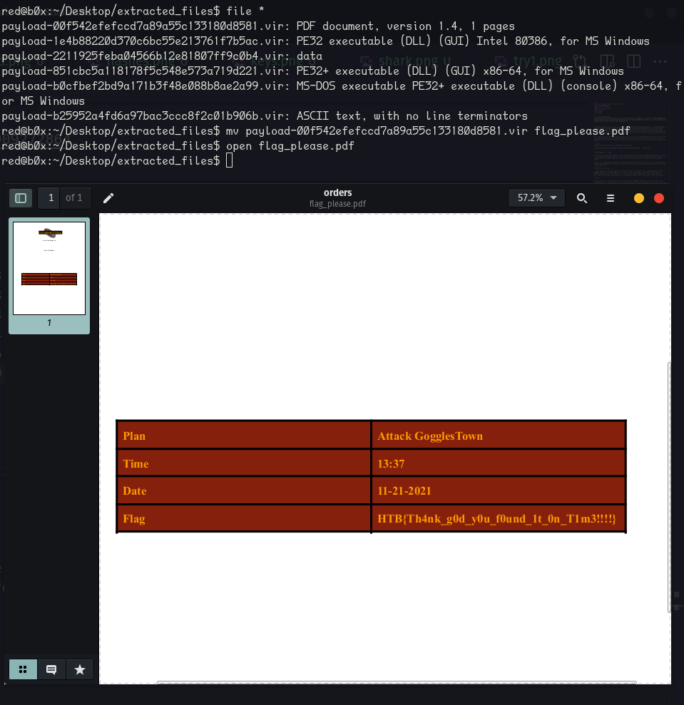

:::warning[Description]
**A fleet of steam blimps waits the final signal from their commander in order to attack gogglestown kingdom. Recent cyber attack had us thinking if the enemy managed to discover our plans and prepare a counter-attack. Will the fleet get ambused???** 
:::


For this challenge we are given a zip file containing two challenge attachments: a `capture.pcapng` **(network capture file)**  and `freesteam.dmp` **(Mini DuMP crash report)**. For those who haven’t worked with minidump files before, these types of files are generally generated from application process memory when an application crashes. They contain essential information needed to diagnose and debug the issue, such as the call stack, loaded modules, and the state of various system variables at the time of the crash. 

Since we're dealing with a forensics challenge, let's first get the SHA-256 checksum of the file and try uploading the hash to popular services like VirusTotal to see the results. This will help us determine if the file has already been analyzed and if there are any known security issues associated with it.

```shell
red@b0x:~/ctfs/htb-forensics$ sha256sum freesteam.dmp 

67527ad19ba7c3b363a4b6fa6ad8664e77ce65dc7f8b628b93338851f09805df  freesteam.dmp
```



Two Security Vendors have identified this crashdump being apart of the [Cobalt Strike](https://attack.mitre.org/software/S0154/) beacon. Cobalt Strike is a tool frequently used by offensive security professionals to conduct adversary simulations and execute attacks that mimic real-world threat actors.

While this finding appears promising, we should approach it with caution, as only a limited number of vendors have flagged it as malicious. Therefore, let's proceed with analyzing the packet capture file in the meantime.

  

👀 Upon opening the packet capture file and inspecting `tcp.stream eq 0`, I immediately noticed a **GET** request to the IPv4 address `192.168.1.9` over port `8080`, attempting to retrieve an executable file named `freesteam.exe`. If this doesn't appear malicious, I don't know what does. Let's quickly pull that executable out of the capture and see what `VirusTotal` has to say about it. 

:::note

While exporting the executable, I also noticed several **POST** requests to the URI `submit.php?id=1909272864`. As someone who has dissected multiple Cobalt Strike payloads, I can confirm that this behavior is very common. The id parameter is typically randomly generated and is used with the default profile, which makes it easier to write network-based signatures for malicious traffic.
:::

Using Wireshark's `Export HTTP Objects` feature, I extracted the suspicious executable and then ran `md5sum` to generate the file hash:

```shell
red@b0x:~/ctfs/htb-forensics$ md5sum freesteam.exe 

10d01baf19d5d2448799e440095a8035  freesteam.exe
```

Uploading the **MD5** hash to VirusTotal has yielded very **concerning** results.

 

It appears that we're making progress. The VirusTotal analysis of the `MD5` hash has revealed a high score of `65/74`, indicating a high likelihood of malicious activity. Furthermore, the community tab within VT reinforces our suspicions, with indications pointing towards this file actually being a Cobalt Strike beacon.

Now that we've successfully identified the key components to solving this challenge, it's time to proceed with further analysis. Upon revisiting the packet capture file, we note that there isn't a big amount of traffic, with only **15 TCP streams** recorded. However, it's important to observe that while the traffic appears to be `plain-text`, it is not necessarily so. The server and client communications are encrypted.

One of the logical steps for us to take is to decrypt the traffic. Before we can do that we need to understand how the encryption works on a very surface level. 

 

The beacon being our **client** and the Cobalt Strike team-server **(c2)** are both encrypted with AES, even when the beacon type is set to use `HTTPS`.

:::note
**Cobalt Strike Supports multiple Listener types/modes.** 

**HTTP/HTTPS is by far the most common listener type. Which is also the easiest to spot.**

**DNS listeners establish sessions to their team server using DNS requests for domains the team server is authoritative for.**

**There are some other ones, but I won't include those here. Will leave blog posts for reference at the end of this write-up.**
:::

While reading other blog post's I've figured that Cobalt Strike stores `public` and `private` keys in a file called **.cobaltstrike.beacon_keys**. This file is generated when Cobalt Strike is ran for the first time on the system.

Alright, enough discussion—let's proceed with decrypting the traffic. There are multiple ways to approach this. One method involves using a tool called `cs-extract-key.py` to pull metadata that contains the AES and HMAC keys from the Mini DuMP crash report. While this method is not guaranteed to work in every case, as it requires the beacon to be version 3 with unencrypted RSA metadata, it's worth attempting. Let's see if we can extract the necessary keys and use them to decrypt the traffic.


::github{repo="DidierStevens/Beta"}

The full script can be found in this GitHub repository.

 


It appears we didn't retrieve any keys, which suggests that the beacon version is `4`, not 3. We shouldn't feel defeated in this scenario; there is actually another way to obtain the keys. We can extract the `encrypted` data from the first **POST** request of the beacon to the C2 (callback). This data may contain the necessary information for decrypting the traffic. 

We can use a simple wireshark filter to get the first POST request. `http.request.method == POST`

 

According to the author of `cs-extract-key.py`, we can pass the **encrypted** string to the tool using the -c switch. The tool will then perform a dictionary attack to extract all possible AES and HMAC keys. If everything goes well, we should obtain the correct keys.

 


Awesome, it seems like everything worked smoothly. Our next step is to use a different script `cs-parse-http-traffic.py` to parse the encrypted traffic directly from the packet capture, using the HMAC and AES keys we found. This will allow us to decrypt and analyze the communication between the beacon and the C2 server, which could possibly have the flag we're looking for!


> * `HMAC:bf2d35c0e9b64bc46e6d513c1d0f6ffe`
> * `AES:3ae7f995a2392c86e3fa8b6fbc3d953a`

Woah! It successfully decrypted the traffic. Looking at the results, we observe some interesting behavior, such as the dumping of password hashes.



I tried cracking those password hashes with CrackStation, but didn't get any useful results back. This suggests that we might be missing something obvious.

Taking **another** look at the decrypted data: we spot this.

```
Packet number: 224
HTTP request POST
http://192.168.1.9/submit.php?id=1909272864
Length raw data: 324
Counter: 6
Callback: 22 TODO
b'\xff\xff\xff\xfe'
-----------------------------------------------------------------------------
C:\Users\npatrick\Desktop\*
D       0       11/19/2021 12:24:08     .
D       0       11/19/2021 12:24:08     ..
F       5175    11/11/2021 03:24:13     cheap_spare_parts_for_old_blimps.docx
F       282     11/10/2021 07:02:24     desktop.ini
F       24704   11/11/2021 03:22:16     gogglestown_citizens_osint.xlsx
F       62393   11/19/2021 12:24:10     orders.pdf

------------------------------------------------------------------------------
```

Those document files look confidential; let's try pulling them right now using the `--extract` option.




We've gotten 6 files, let's transfer those on a linux machine **(my localhost)** to see which one is which. I'm going to make a shared folder between my host and vm, for an easier transfer.



Now if we open that `PDF` we get the flag!


:::caution[FLAG]
`HTB{Th4nk_g0d_y0u_f0und_1t_0n_T1m3!!!!}`
:::

Thank you for reading this post! I hope you found it informative and learned something new. Dissecting Cobalt Strike traffic can be fascinating and educational. I appreciate your time and interest. Until next time~