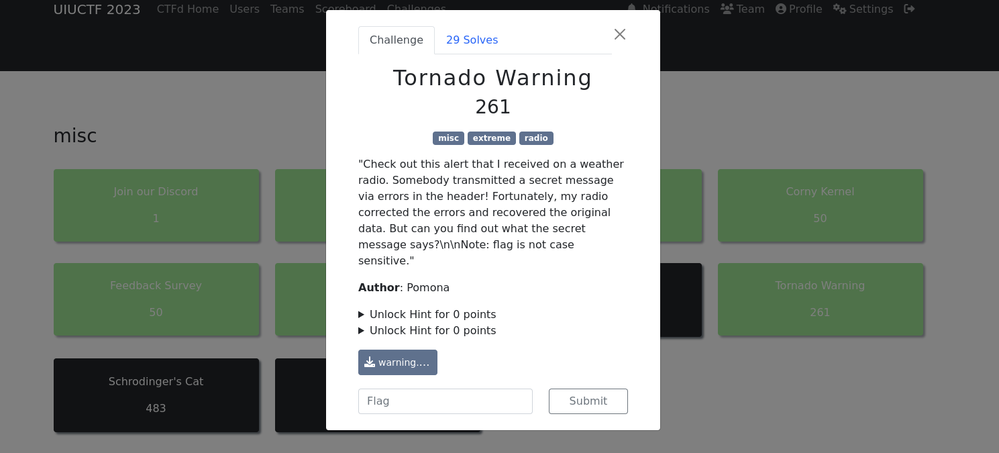

Here we go again, let’s first download the file from the challenge attachments and see what we are working with this time. Once the file is on our machine its time to run the `file` command to determine the type and it might be useful to run `exiftool` as well.

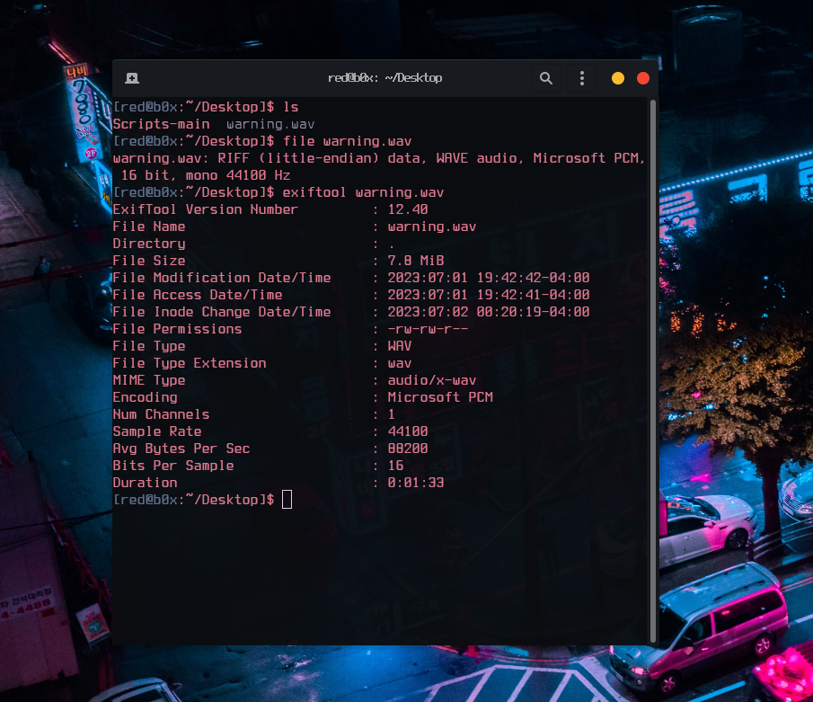

Doing simple checks tells us that the file is valid and flag is for sure hidden inside the `.wav` file, but what can we do next ? My next step was to check it out inside **AUDACITY** and view the spectogram.

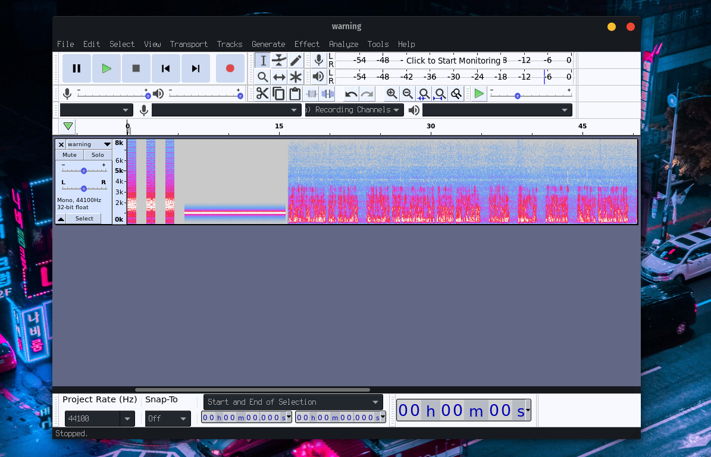

Once that was done, I didn’t achieve anything. After all this challenge is not related to Steganography in anyway and even if it was, there would definitely be more steps to it, regarding the challenge difficulty. My next step was to play the WAVE file and listen to it carefully. I quickly realized that this was a severe weather alert message. If anyone is wondering, this is how it sounds `https://www.youtube.com/watch?v=VPGczKUlgd8` . So what’s next ? RESEARCH of course ! After some googling around I found an interesting protocol `SAME` this protocol stands for **Specific Message Area Encoding** which is used by the Weather Radios in USA and Canada, as well as the **Emergency Alert System** on television and radio.

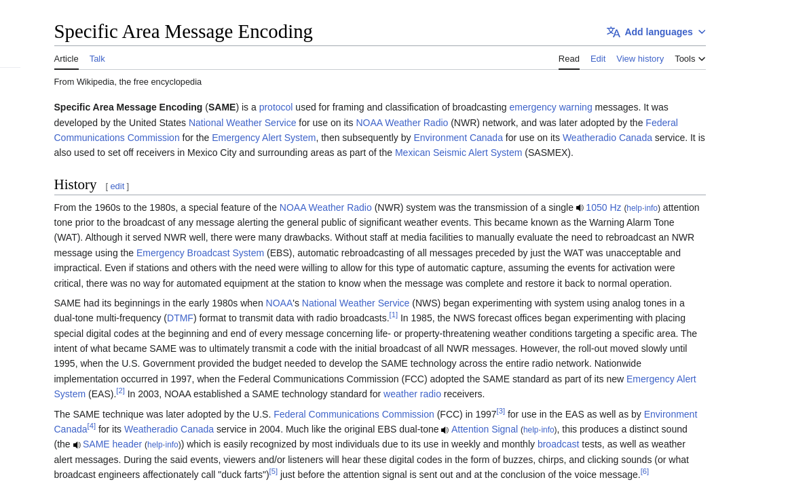


You may ask “but how can we be sure its the right protocol used for this challenge ?” . Well remember how I said the spectogram did not mean anything ? It actually did mean a lot to us , as it shows the actual structure of the **SAME** message transmitted over the radio. The first 3 data bursts contain a digital `message` packet followed by a long alert tone which is **then** followed by the actual announcement message. Amazing :) now we have an idea what we need to do, is to decode the message and see what it was transmitting. I found a decoder online which I will use **`SeaTTY`**, but it was for windows only so… let me start up my virtual machine really quick and I’ll get back to you.

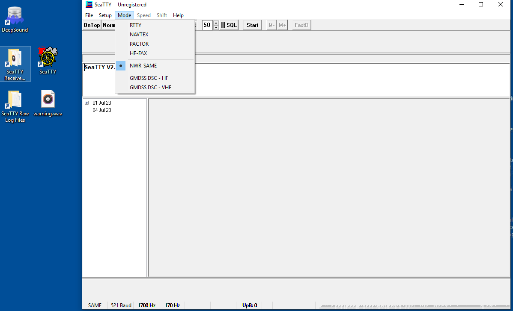

Okay this is going pretty well , we are learning ! One thing to note here is to select the **`NWR-SAME`** mode for the decoder. Once that was done we play the message and pray it works.

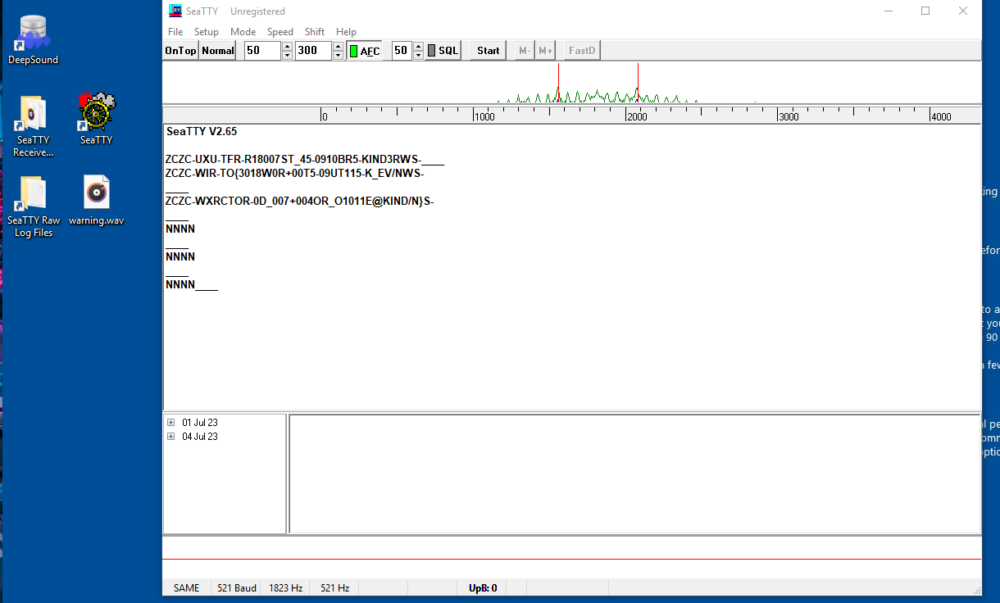


That is exactly what I was waiting for. We got the proper decoded data bursts from the SAME protocol. 

Which are :

```
ZCZC-UXU-TFR-R18007ST_45-0910BR5-KIND3RWS-
ZCZC-WIR-TO{3018W0R+00T5-09UT115-K_EV/NWS-
ZCZC-WXRCTOR-0D_007+004OR_O1011E@KIND/N}S-
```


Since I’ve done some research online on how these messages are structured, I can explain on what each part means, but first thing before I forget. We need to know that it will repeat three times to try to possibly eliminate any errors from poor reception. The correct data will be chosen using a columnar parity error algorithm. Therefore `ZCZC` is the **Message Activation** Code after that comes `WXR` which is the Originator for example **NOAA Weather Radio**, followed by that we have TOR which means it is a **Tornado Warning**, the first `-******` can mean pretty much anything and so do the other ones. Below I will add a few images so that we can better understand the concept. As well as, a youtube video which goes in depth.

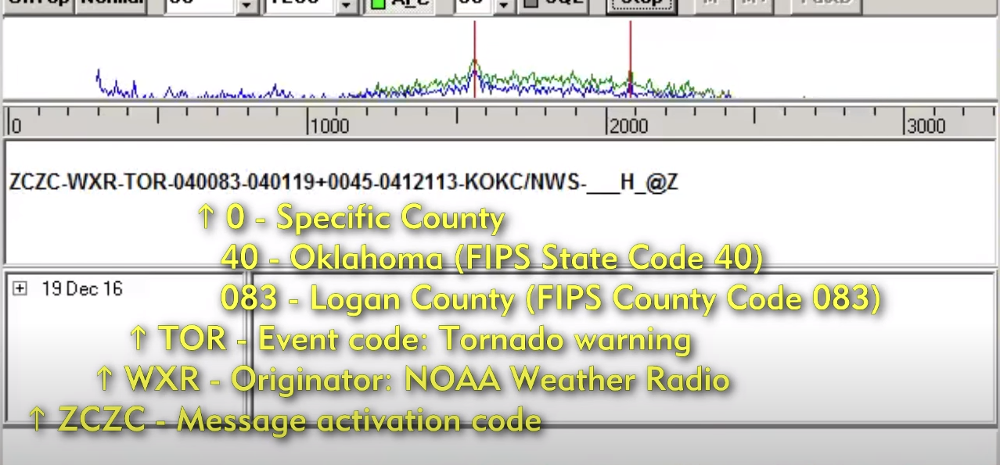

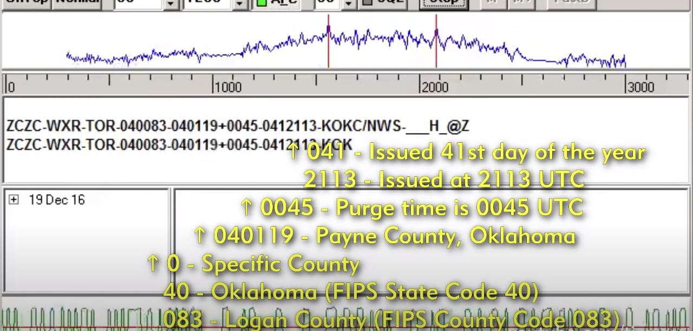

**`https://www.youtube.com/watch?v=OpLFRGcm7_k`**


At this point I needed to find a tool to decode the message and I did.

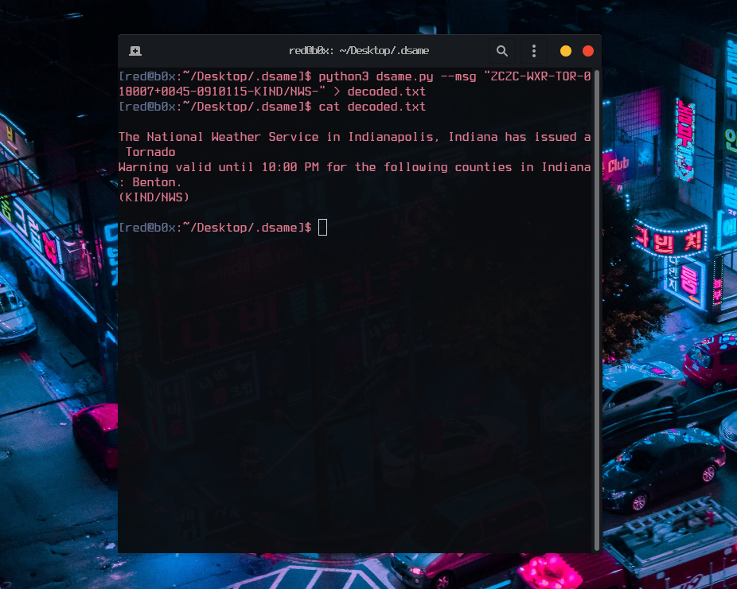

**The National Weather Service in Indianapolis, Indiana has issued a Tornado Warning valid until 10:00 PM for the following counties in Indiana: Benton. (KIND/NWS)** . UHHH what where is the flag? This really got me confused so I decided to open the ticket with the organizers for a sanity check and I got this.

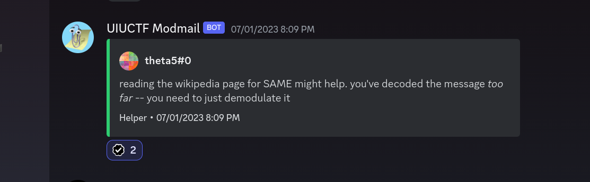

Found it pretty funny, but seems like we need to go back and see what we are working with. After staring down on the decoded strings something clicked in my head and I saw the pattern for the flag.

```
ZCZC-UXU-TFR-R18007ST_45-0910BR5-KIND3RWS-
ZCZC-WIR-TO{3018W0R+00T5-09UT115-K_EV/NWS-
ZCZC-WXRCTOR-0D_007+004OR_O1011E@KIND/N}S-
```

Taking a look again there is one unique character that is different in each message so we need to grab it one by one and build it to the flag.

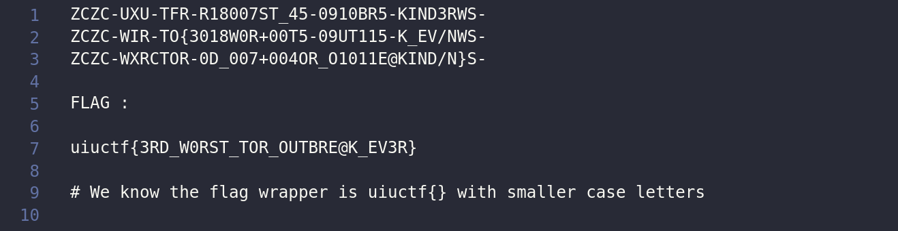

WHEW ! That was very fun :) we got the flag and the valuable points that my team needed to come 33rd out of 1200+ teams. Special shoutout to my teammates **Suvoni** and **kibeththewalker** for sticking around with me for this challenge `GG !`

:::caution[Flag]
**`uiuctf{3RD_W0RST_TOR_OUTBRE@K_EV3R}`**
:::